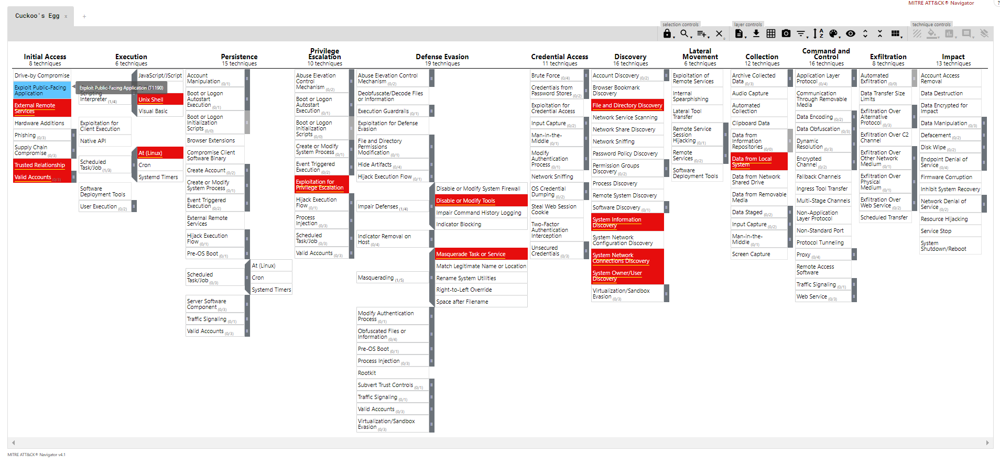
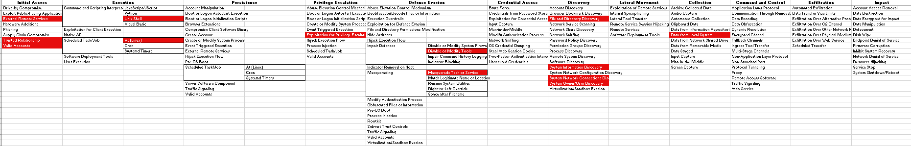

# Cuckoo's Egg ATT&CK Mapping
This repo contains the the ATT&CK Navigator layer both in JSON and Excel for the adversary's TTPs in Chapter 4 of "The Cuckoo's Egg". 

### Instructions for loading JSON file into ATT&CK Navigator
* Download the <code>Cuckoo's_Egg.json</code> file to your local system
* Go to https://mitre-attack.github.io/attack-navigator/ and select *Open Existing Layer*
* Select *Open from local* and navigate to where you saved the JSON file

You should then see the following:

The Excel layer will look similar to Navigator (but in Excel of course)

